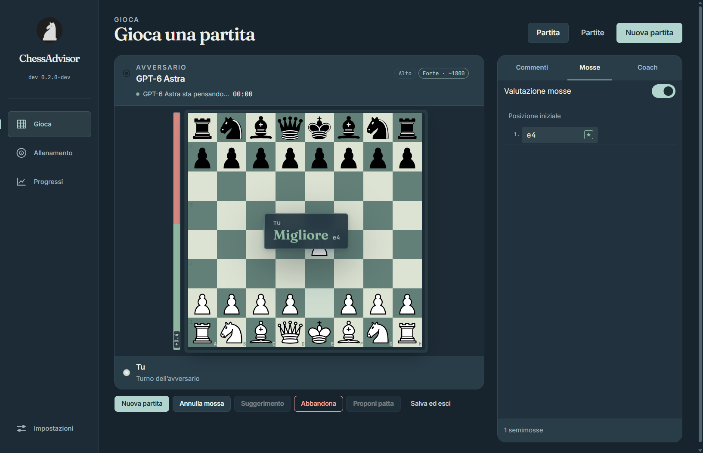
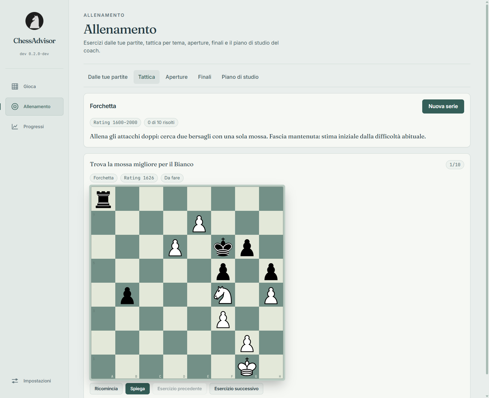

# ChessAdvisor

**Play a real game. Understand every move. Train what cost you the position.**

ChessAdvisor is a Windows chess companion that pairs OpenAI models, reached through your
authenticated Codex CLI session, with Stockfish analysis. The model plays and coaches in natural
language; Stockfish supplies measured chess evidence for live move grades, review, and training.

[Download the latest Windows build](https://github.com/leonardostagliano/ChessAdvisor/releases/latest) · [Build from source](#development) ·
[Read the privacy model](#privacy)



_Demo session._

## Why ChessAdvisor

Most chess apps separate playing, analysis, and study. ChessAdvisor keeps them in one loop:

1. Play a complete game against the OpenAI model and difficulty you choose.
2. See a quick Stockfish estimate after either side moves, with the same judgement carried into
   the move list and coach commentary. The deeper post-game review can refine it. Turn **Move
   evaluation** off at any time if you prefer a quiet board.
3. Ask the coach about the current position, request a hint, or read its move-by-move commentary.
4. Review the finished game with full Stockfish analysis, then train from the mistakes it found.

The coach receives the same engine evidence shown by the visible badge, so its explanation starts
from the measured position rather than an unrelated impression.

## How the opponent thinks

Every legal move remains available to the model. The selected tier controls Stockfish search
depth, time, candidate moves, and a tactical loss ceiling. Lower tiers search broadly and
shallowly; higher tiers search more deeply and apply tighter tactical checks. A local pilot of
Chess.com Rapid games supplies phase- and rating-aware human move-loss distributions and opening
frequencies as context. If the model cannot supply a valid answer, the engine fallback samples a
candidate near that distribution within the tactical ceiling. The model's accepted legal moves
are not deliberately weakened to meet an error quota. Adaptive mode interpolates its policy from
its current target rating; Maximum has no assigned Elo target.

These are relative difficulty settings, not measured Elo ratings. Model choice, reasoning effort,
and the position still affect strength. The Rapid sample is observational and does not establish
the opponent's playing Elo. See [Rapid calibration pilot](docs/rapid-calibration-results.md) for
the method, coverage, and limits. The opponent resigns conservatively only when the position and
recent engine evidence support it.

In known opening positions, a contextual opening book adds the recognized line and candidate
continuations to that evidence. It informs the model without reducing the position to a fixed
opening script: every legal move remains available.

## Features

- **Complete games** with colour choice, six requested difficulty styles or adaptive mode,
  optional clocks, takebacks, draw offers, resignation, autosave, and resume from the archive.
  Difficulty ratings describe the requested playing style; they are not calibrated Elo claims.
- **Live move feedback** for both players: a brief board overlay, persistent accessible badges,
  honest pending and unavailable states, and a setting available during play and in Settings.
- **AI coach** with streamed answers, position-aware hints, move comments, and commentary grounded
  in the same Stockfish evaluation shown in the interface.
- **Post-game review** with accuracy, ACPL, evaluation graph, classified moves, key moments, and a
  written lesson with practical takeaways.
- **Personal training** from your own mistakes, thematic puzzle sets whose theme and rating band
  follow measured game and exercise results, Stockfish-grounded explanations and opening
  mini-lessons, canonical endgame drills, and an evidence-based study plan.
- **Progress tracking** with exact archive-based win/draw/loss totals at game end, followed by
  accuracy trends, move classifications, themes, openings, and an evolving level estimate.
  Progress, the study plan, and game-derived exercises update automatically; interrupted analyses
  resume at startup. Deleting a game cancels its analysis and removes its learning contributions.
- **Desktop polish** with Night and Editorial themes, Italian and English, keyboard navigation,
  a tray icon, and in-app updates.



## Requirements

- Windows 10 or 11, x64.
- [Codex CLI](https://github.com/openai/codex) installed and authenticated with `codex login`.
- A ChatGPT plan with Codex access and available quota. Opponent and coach requests use that quota.

ChessAdvisor does not ask for an API key. It talks to `codex app-server` through your existing
Codex login. Stockfish is bundled in release builds and runs locally; if it is unavailable, the
app reports that evaluations are unavailable while model-powered play and coaching continue.

## Install and first run

1. Download `ChessAdvisor-<version>-x64.exe` from the
   [latest release](https://github.com/leonardostagliano/ChessAdvisor/releases/latest), or choose
   the portable build.
2. Start ChessAdvisor. The startup check verifies the Codex CLI, authentication, and the isolated
   game environment, then gives a concrete fix for anything missing.
3. Select a model, playing style, colour, and clock in **New game**.

An interrupted game is saved automatically and can be resumed from **Games**.

When upgrading to 0.2.0, the first launch archives the previous derived profile, exercises, and
study plan under `data/backups`, then rebuilds learning from the new evidence model. Saved games
and PGNs remain intact, legacy game IDs are excluded from the new profile, and independent
thematic-puzzle and endgame attempts are preserved.

## Privacy

ChessAdvisor keeps games, analyses, profile data, exercises, and settings as JSON files under
`%APPDATA%\chessadvisor`. Writes are atomic, and `CHESSADVISOR_USER_DATA` can move the complete
data folder elsewhere.

AI features are network features. When you make an opponent or coach request, the relevant chess
position, move history, instructions, and available Stockfish evidence are sent to OpenAI through
the Codex CLI under your existing account and agreement. ChessAdvisor does not send unrelated
files or machine contents.

Games run with a dedicated Codex home at `%APPDATA%\chessadvisor\codex-home`. It contains a minimal
configuration with plugins and MCP servers disabled, hooks off, a read-only sandbox, and approvals
disabled. The app copies the authentication material needed by Codex into that isolated home and
verifies the setup at startup; it does not load your normal Codex instructions, hooks, plugins, or
MCP configuration into a game session.

Stockfish evaluation and the local training datasets run on the computer. They do not require an
additional online chess service.

## Development

```sh
npm install
npm run fetch:stockfish     # Stockfish 17.1 binaries in resources/engine (not committed)
npm run build:datasets      # optional: rebuild openings, puzzles, and endgames
npm run dev                 # set CHESSADVISOR_FAKE_CODEX=1 to use the fake app-server
```

| Script                            | Purpose                                                              |
| --------------------------------- | -------------------------------------------------------------------- |
| `npm run dev`                     | Run electron-vite in watch mode                                      |
| `npm test`                        | Run the complete Vitest suite                                        |
| `npm run typecheck`               | Type-check the main and renderer projects                            |
| `npm run build`                   | Create the production bundle in `out/`                               |
| `npm run build:win`               | Create NSIS and portable Windows builds in `release/`                |
| `npm run smoke:win`               | Verify the packaged application, engine, and datasets                |
| `npm run e2e`                     | Run end-to-end tests against the fake app-server without using quota |
| `npm run e2e:real`                | Run the same flow against Codex; this uses quota                     |
| `npm run codex:types`             | Regenerate protocol bindings from the installed Codex CLI            |
| `npm run gen-icon`                | Rebuild icons from the ChessAdvisor logo                             |
| `npm run rapid:collect -- ...`    | Collect a bounded, cached Chess.com Rapid sample                     |
| `npm run rapid:analyze -- ...`    | Analyze sampled positions with local Stockfish                       |
| `npm run rapid:benchmark -- ...`  | Compare fallback policies on held-out positions                      |
| `node scripts/check-contrast.mjs` | Check both palettes against WCAG contrast minimums                   |

The Stockfish binaries are not stored in git. Run `npm run fetch:stockfish` before packaging.

### End-to-end tests

`npm run e2e` drives the packaged renderer with Playwright and `test/fake-app-server.mjs`. It plays
legal chess moves, streams comments, uses an isolated `CHESSADVISOR_USER_DATA` directory, and does
not spend Codex quota. `npm run e2e:real` uses the authenticated CLI and does spend quota.

`node test/e2e/training.e2e.mjs` covers explanations, navigation, opening mini-lessons, study-plan
generation, and endgame launch. Its `--real` variant makes live coach requests and uses quota.

`node test/e2e/live-feedback.e2e.mjs` checks move-to-grade latency, overlay expiry while other
session events arrive, the in-game toggle, persistent badges, and the 1024 × 720 layout.

### Packaging

`npm run build:win` produces an NSIS installer, a portable executable, and `win-unpacked`. On
Windows, electron-builder may need permission to create symbolic links: enable Developer Mode or
run the packaging terminal as administrator if it reports `Cannot create symbolic link`.

The packaged smoke test can also be run directly:

```sh
RELEASE_VERSION=0.2.0 ELECTRON_RUN_AS_NODE=1 ./release/win-unpacked/ChessAdvisor.exe scripts/smoke-windows.cjs release/win-unpacked
```

Local builds do not publish anything. `.github/workflows/windows-release.yml` creates releases
from pushes to `main`, runs the build and smoke test, and attaches both executables plus
`SHA256SUMS.txt`.

## Keyboard

Press `?` for the shortcut sheet. Use `←`/`→` to move through a game or review, `Home`/`End` to
jump to the first or current position, `1`–`4` to choose a promotion piece, and `Esc` to close a
dialog.

## License

ChessAdvisor is GPL-3.0-only. See [LICENSE](LICENSE). Notices for Stockfish, chessground, chess.js,
the cburnett pieces, fonts, and Lichess datasets are in
[THIRD-PARTY-NOTICES.md](THIRD-PARTY-NOTICES.md) and in **Settings → About and licences**.
